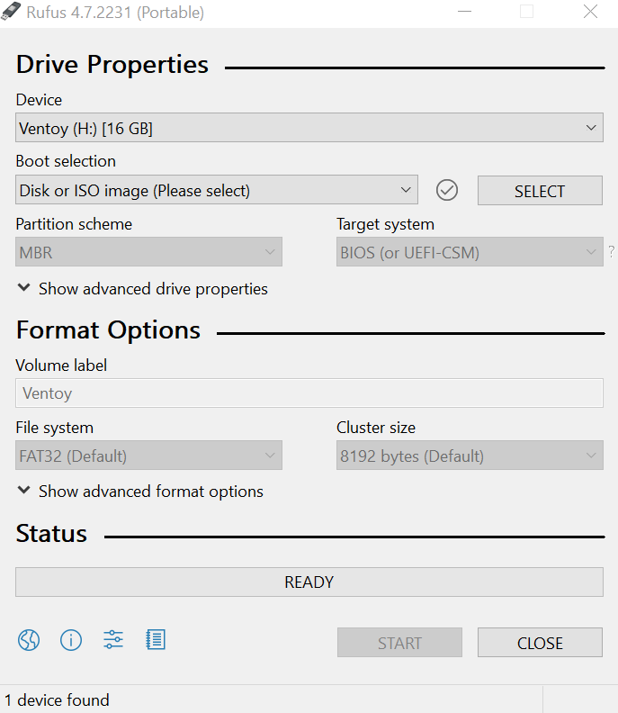

# 💿 Creating a Bootable USB Drive

> This guide covers multiple methods to create an Arch Linux installation USB.


## 📋 Table of Contents

- [Download Arch Linux ISO](#-download-arch-linux-iso)
- [Verify the ISO](#-verify-the-iso-optional-but-recommended)
- [Creating the USB](#-creating-the-usb)
  - [Windows Methods](#windows)
  - [Linux Methods](#linux)
  - [macOS Methods](#macos)
- [Troubleshooting](#-troubleshooting)

---

## 📥 Download Arch Linux ISO

### Official Download

1. Visit the official download page: **[archlinux.org/download](https://archlinux.org/download/)**
2. Choose a mirror close to your location
3. Download the ISO file (approximately 800MB-1GB)

### File naming:
```
archlinux-YYYY.MM.DD-x86_64.iso
```
Example: `archlinux-2024.11.01-x86_64.iso`

> 💡 **Tip:** Always download from official sources to avoid compromised images.

---

## 🔐 Verify the ISO (Optional but Recommended)

Verifying ensures your download isn't corrupted or tampered with.

### On Windows (PowerShell):

```powershell
# Navigate to download folder
cd ~/Downloads

# Calculate SHA256 hash
Get-FileHash archlinux-*.iso -Algorithm SHA256
```

### On Linux:

```bash
# Calculate SHA256 hash
sha256sum archlinux-*.iso
```

Compare the output with the checksum on the download page.

---

## 🔧 Creating the USB

Choose your operating system:

---

### Windows

#### Method 1: Rufus (Recommended) ⭐

**Rufus** is the most reliable tool for creating bootable USB drives.

1. **Download Rufus:** [rufus.ie](https://rufus.ie/)
2. **Insert your USB drive** (8GB+ recommended)
3. **Run Rufus** (no installation needed)
4. **Configure settings:**

| Setting | Value |
|---------|-------|
| Device | Select your USB drive |
| Boot selection | Select the Arch Linux ISO |
| Partition scheme | **GPT** |
| Target system | **UEFI (non CSM)** |
| File system | FAT32 (Large) or ISO default |
| Cluster size | Default |

5. Click **START**
6. If prompted, select **Write in ISO Image mode**
7. Wait for completion (2-5 minutes)



> ⚠️ **Warning:** This will erase all data on the USB drive!

---

#### Method 2: Ventoy (Multi-ISO USB)

**Ventoy** allows you to have multiple ISOs on one USB drive.

1. **Download Ventoy:** [ventoy.net](https://www.ventoy.net/)
2. **Extract and run** Ventoy2Disk.exe
3. **Select your USB drive** and click **Install**
4. **Copy the Arch ISO** directly to the USB drive
5. Boot and select Arch Linux from the Ventoy menu

**Advantages:**
- Multiple ISOs on one drive
- No need to reformat for different ISOs
- Just copy new ISOs to add them

---

#### Method 3: balenaEtcher

Simple, cross-platform tool.

1. **Download:** [balena.io/etcher](https://www.balena.io/etcher/)
2. Select **Flash from file** → Choose Arch ISO
3. Select **Target** → Choose USB drive
4. Click **Flash!**

---

### Linux

#### Method 1: dd Command (Recommended) ⭐

The `dd` command directly writes the ISO to the USB drive.

```bash
# First, identify your USB drive
lsblk

# Look for your USB drive (e.g., /dev/sdb)
# Make sure to identify the correct drive!

# Unmount the drive if mounted
sudo umount /dev/sdX*

# Write the ISO (replace X with your drive letter)
sudo dd bs=4M if=archlinux-*.iso of=/dev/sdX status=progress oflag=sync
```

**Understanding the command:**

| Parameter | Meaning |
|-----------|---------|
| `bs=4M` | Block size of 4 megabytes (faster writing) |
| `if=` | Input file (the ISO) |
| `of=` | Output file (your USB drive, NOT a partition) |
| `status=progress` | Show writing progress |
| `oflag=sync` | Synchronous writing (safer) |

> ⚠️ **CRITICAL:** Use `/dev/sdX` (whole drive), not `/dev/sdX1` (partition). Double-check the drive letter - `dd` can destroy data if pointed at the wrong drive!

---

#### Method 2: Using cp (Simple alternative)

```bash
# Identify USB drive
lsblk

# Write ISO using cp
sudo cp archlinux-*.iso /dev/sdX
sudo sync
```

---

#### Method 3: Using Ventoy

```bash
# Download and extract Ventoy
wget https://github.com/ventoy/Ventoy/releases/download/v1.x.x/ventoy-x.x.x-linux.tar.gz
tar -xzf ventoy-*.tar.gz
cd ventoy-*

# Install to USB drive
sudo ./Ventoy2Disk.sh -i /dev/sdX

# Mount and copy ISO
sudo mount /dev/sdX1 /mnt
sudo cp archlinux-*.iso /mnt/
sudo umount /mnt
```

---

### macOS

#### Method 1: dd Command

```bash
# List disks
diskutil list

# Find your USB drive (e.g., /dev/disk2)

# Unmount the drive
diskutil unmountDisk /dev/diskN

# Write ISO (use 'rdisk' for faster writing)
sudo dd if=archlinux-*.iso of=/dev/rdiskN bs=4m status=progress

# Eject when done
diskutil eject /dev/diskN
```

> 💡 **Tip:** Use `/dev/rdiskN` (raw disk) instead of `/dev/diskN` for much faster writing.

---

#### Method 2: balenaEtcher

Same as Windows - download from [balena.io/etcher](https://www.balena.io/etcher/)

---

## ✅ Verify USB Creation

After creating the USB:

1. **Safely eject** the USB drive
2. **Reinsert** the USB drive
3. **Check contents** - you should see files like:
   - `arch/`
   - `EFI/`
   - `loader/`
   - `shellx64.efi`

If you see these files, your bootable USB is ready!

---

## 🔧 Troubleshooting

### "USB not bootable"

- Ensure you wrote to the drive (`/dev/sdX`), not a partition (`/dev/sdX1`)
- Try using Rufus with "Write in DD Image mode"
- Recreate the USB with a different tool

### "Invalid signature" or "Security violation"

- Disable Secure Boot in BIOS
- See [BIOS Settings](bios-settings.md)

### USB drive not recognized in BIOS

- Try a USB 2.0 port instead of USB 3.0
- Disable Fast Boot in BIOS
- Try a different USB drive

### Write speed very slow

- Use a USB 3.0 drive in a USB 3.0 port
- On macOS, use `/dev/rdiskN` instead of `/dev/diskN`
- Increase block size: `bs=8M` or `bs=16M`

---

## 📖 Understanding the Process

### What happens when you create a bootable USB?

1. **ISO Image:** The Arch Linux ISO is a disk image containing:
   - Linux kernel
   - Initial RAM filesystem
   - Installation tools
   - Live environment

2. **Writing Process:** Tools like `dd` or Rufus write this image byte-by-byte to the USB drive, making it bootable.

3. **UEFI Boot:** The USB drive contains an EFI partition that UEFI firmware can recognize and boot from.

---

## ➡️ Next Steps

Your bootable USB is ready!

→ [Live Environment Setup](live-environment.md)

---

<div align="center">

[← BIOS Settings](bios-settings.md) | [Back to Main Guide](../../README.md) | [Next: Live Environment →](live-environment.md)

</div>
