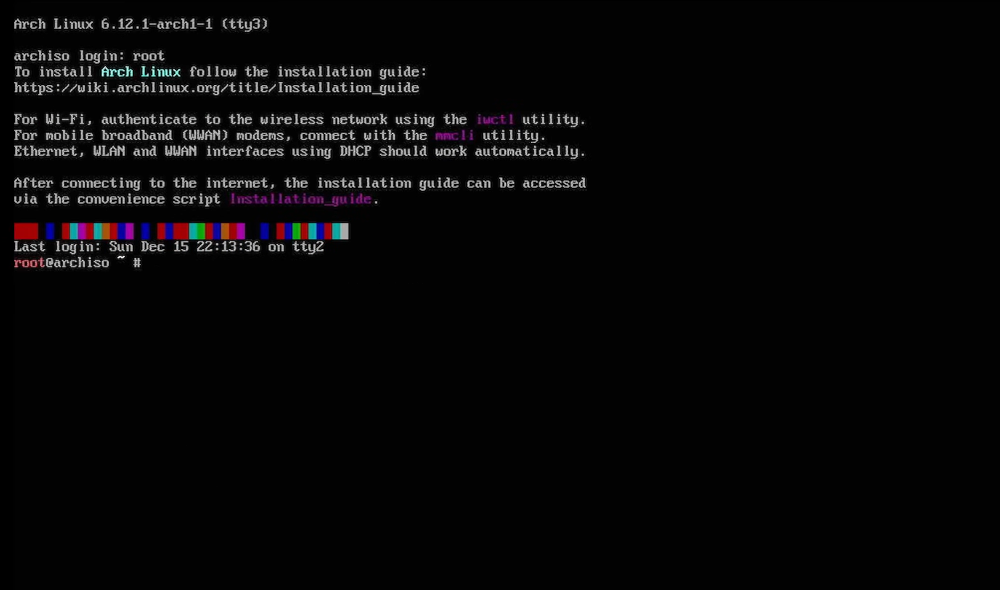

# 🖥️ Live Environment Setup

> This guide covers booting into the Arch Linux live environment and initial setup before installation.



## 📋 Table of Contents

- [Booting the USB](#-booting-the-usb)
- [First Steps in Live Environment](#-first-steps-in-live-environment)
- [Setting Console Font](#-setting-console-font)
- [Connecting to the Internet](#-connecting-to-the-internet)
- [System Clock](#-system-clock)
- [Updating Package Database](#-updating-package-database)
- [Verifying Boot Mode](#-verifying-boot-mode)

---

## 🚀 Booting the USB

### Step 1: Insert USB and Boot

1. Insert your bootable USB drive
2. Restart/Power on your computer
3. Press the **Boot Menu key** (F12, F8, etc.) or enter BIOS

### Step 2: Select Boot Device

From the boot menu, select your USB drive:

```
UEFI: USB Drive Name
    or
UEFI: Generic Flash Disk
```

> ⚠️ **Important:** Make sure to select the **UEFI** option, not Legacy!

### Step 3: GRUB Menu

You'll see the Arch Linux boot menu:

```
Arch Linux install medium (x86_64, UEFI)
Arch Linux install medium (x86_64, UEFI) with speech
Memtest86+
EFI Shell
Reboot
Power Off
```

Select the first option and press **Enter**.

---

## 🎯 First Steps in Live Environment

After booting, you'll see a command prompt:

```
root@archiso ~ # 
```

**Congratulations!** You're now in the Arch Linux live environment.

### What is the Live Environment?

The live environment is a complete Linux system running from your USB drive. It has:
- Root access (administrator privileges)
- Networking tools
- Disk partitioning tools
- All tools needed for installation

---

## 🔤 Setting Console Font

The default console font is tiny, especially on high-resolution displays. Let's fix that!

### Set a Larger Font

```bash
setfont ter-132n
```

**Command Breakdown:**
| Part | Meaning |
|------|---------|
| `setfont` | Command to change console font |
| `ter-132n` | Terminus font, size 32, normal weight |

### Available Font Sizes

```bash
# List all available fonts
ls /usr/share/kbd/consolefonts/ | grep ter

# Common Terminus font sizes:
# ter-116n  - Small (16)
# ter-120n  - Medium (20)
# ter-124n  - Large (24)
# ter-128n  - Larger (28)
# ter-132n  - Extra Large (32) - Recommended for HiDPI
```

> 💡 **Tip:** For 4K displays, use `ter-132n`. For 1080p, `ter-120n` works well.

---

## 🌐 Connecting to the Internet

Internet is required for installation. Choose your connection method:

### Check Current Connection

```bash
ip addr
```

**What this shows:**
- `lo` - Loopback interface (ignore this)
- `eth0` or `enp*` - Ethernet interface
- `wlan0` or `wlp*` - WiFi interface

### Test Connection

```bash
ping -c 3 archlinux.org
```

**Command Breakdown:**
| Part | Meaning |
|------|---------|
| `ping` | Send ICMP packets to test connectivity |
| `-c 3` | Count: send only 3 packets |
| `archlinux.org` | Target host to ping |

**Expected output:**
```
64 bytes from archlinux.org: icmp_seq=1 ttl=x time=xx.x ms
64 bytes from archlinux.org: icmp_seq=2 ttl=x time=xx.x ms
64 bytes from archlinux.org: icmp_seq=3 ttl=x time=xx.x ms
```

---

### Option A: Ethernet (Recommended) ⭐

Ethernet usually works automatically via DHCP.

```bash
# Check if connected
ip link show

# If interface is DOWN, bring it up
ip link set eth0 up

# Get IP address via DHCP
dhcpcd eth0

# Verify connection
ping -c 3 archlinux.org
```

---

### Option B: WiFi Connection 📶

For wireless connections, use `iwctl`:

```bash
# Enter interactive mode
iwctl
```

Inside `iwctl`:

```bash
# List WiFi devices
device list

# Scan for networks
station wlan0 scan

# Show available networks
station wlan0 get-networks

# Connect to your network
station wlan0 connect "Your-Network-Name"
# Enter password when prompted

# Exit iwctl
exit
```

**Full Command Flow:**
```
[iwd]# device list
                     Devices
─────────────────────────────────────────────────
  Name       Address            Powered  Mode
─────────────────────────────────────────────────
  wlan0      xx:xx:xx:xx:xx:xx  on       station

[iwd]# station wlan0 scan
[iwd]# station wlan0 get-networks
                   Available networks
─────────────────────────────────────────────────
  Network name      Security    Signal
─────────────────────────────────────────────────
  MyWiFi            psk         ****
  Neighbor's WiFi   psk         **

[iwd]# station wlan0 connect MyWiFi
Passphrase: ********
[iwd]# exit
```

**Verify WiFi Connection:**
```bash
ping -c 3 archlinux.org
```

---

### Troubleshooting Network Issues

#### WiFi device not found
```bash
# Check if WiFi is blocked
rfkill list

# Unblock if blocked
rfkill unblock wifi
```

#### No DHCP lease
```bash
# Manually start DHCP client
dhcpcd
```

#### Check interface status
```bash
ip link show
# Interface should show "UP"
```

---

## 🕐 System Clock

### Enable Network Time Synchronization

```bash
timedatectl set-ntp true
```

**Command Breakdown:**
| Part | Meaning |
|------|---------|
| `timedatectl` | Control the system time and date |
| `set-ntp true` | Enable NTP (Network Time Protocol) synchronization |

### Set Timezone

```bash
timedatectl set-timezone Asia/Kolkata
```

**Command Breakdown:**
| Part | Meaning |
|------|---------|
| `set-timezone` | Set the system timezone |
| `Asia/Kolkata` | Timezone for India (IST) |

### List Available Timezones

```bash
# List all timezones
timedatectl list-timezones

# Filter by region
timedatectl list-timezones | grep Asia
timedatectl list-timezones | grep America
timedatectl list-timezones | grep Europe
```

### Verify Time Settings

```bash
timedatectl status
```

**Expected output:**
```
               Local time: Mon 2024-11-04 14:30:00 IST
           Universal time: Mon 2024-11-04 09:00:00 UTC
                 RTC time: Mon 2024-11-04 09:00:00
                Time zone: Asia/Kolkata (IST, +0530)
System clock synchronized: yes
              NTP service: active
          RTC in local TZ: no
```

---

## 📦 Updating Package Database

### Synchronize Package Database

```bash
pacman -Sy
```

**Command Breakdown:**
| Part | Meaning |
|------|---------|
| `pacman` | Arch Linux package manager |
| `-S` | Sync operation |
| `-y` | Refresh/download fresh package database |

### Update Keyring (Recommended)

If you're using an older ISO, update the keyring:

```bash
pacman -Sy archlinux-keyring
```

**Why update keyring?**
- Package signing keys expire over time
- New keys are added for new developers
- Prevents "invalid or corrupted package" errors

---

## ✅ Verifying Boot Mode

### Check UEFI Mode

```bash
cat /sys/firmware/efi/fw_platform_size
```

**Results:**
| Output | Meaning |
|--------|---------|
| `64` | 64-bit UEFI mode ✅ (What we want) |
| `32` | 32-bit UEFI mode |
| Error/No file | Legacy BIOS mode ❌ |

```bash
# Alternative check
ls /sys/firmware/efi/efivars
```

If this directory exists, you're in UEFI mode.

> ⚠️ **Important:** If you're not in UEFI mode, reboot and check your BIOS settings!

---

## 🔍 Disk Information

### View Available Disks

```bash
lsblk
```

**Example Output:**
```
NAME        MAJ:MIN RM   SIZE RO TYPE MOUNTPOINT
sda           8:0    0 500.0G  0 disk
├─sda1        8:1    0   100M  0 part
├─sda2        8:2    0   500M  0 part
└─sda3        8:3    0 499.4G  0 part
nvme0n1     259:0    0   1.0T  0 disk
├─nvme0n1p1 259:1    0   512M  0 part
└─nvme0n1p2 259:2    0 999.5G  0 part
sdb           8:16   1   8.0G  0 disk
└─sdb1        8:17   1   8.0G  0 part /run/archiso/bootmnt
```

**Understanding the output:**
| Column | Meaning |
|--------|---------|
| `NAME` | Device name |
| `SIZE` | Device size |
| `TYPE` | disk, part (partition), lvm, crypt |
| `MOUNTPOINT` | Where device is mounted (if any) |

**Common device names:**
- `sda`, `sdb` - SATA drives
- `nvme0n1`, `nvme1n1` - NVMe drives
- `mmcblk0` - SD card / eMMC

---

## 📝 Summary Checklist

Before proceeding to partitioning, verify:

- [ ] Booted in **UEFI mode** (`cat /sys/firmware/efi/fw_platform_size` returns 64)
- [ ] **Console font** is readable (`setfont ter-132n`)
- [ ] **Internet connection** works (`ping archlinux.org`)
- [ ] **Time synchronized** (`timedatectl status`)
- [ ] **Package database** updated (`pacman -Sy`)
- [ ] Identified **target disk** for installation (`lsblk`)

---

## ➡️ Next Steps

Now you're ready to partition your disk!

Choose your partitioning method:
- [Basic Partitioning](../02-partitioning/basic-partitioning.md) - Simple setup
- [Advanced Partitioning](../02-partitioning/advanced-partitioning.md) - Separate /home
- [LVM Setup](../02-partitioning/lvm-setup.md) - Flexible volumes
- [LVM with Encryption](../02-partitioning/lvm-encryption.md) - Full disk encryption

Or first understand partitioning concepts:
- [Partition Overview](../02-partitioning/partition-overview.md)

---

<div align="center">

[← Create Bootable USB](create-bootable-usb.md) | [Back to Main Guide](../../README.md) | [Next: Partition Overview →](../02-partitioning/partition-overview.md)

</div>
