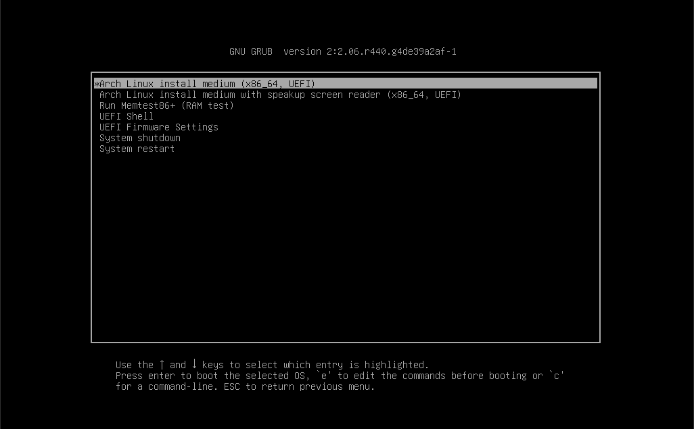

# 🚀 Standard Bootloader Installation

> GRUB setup for **Basic** or **Advanced** partitioning (no LVM, no encryption).



## 📋 Table of Contents

- [Prerequisites](#-prerequisites)
- [Step 1: Create EFI Directory](#step-1-create-efi-directory)
- [Step 2: Install GRUB](#step-2-install-grub)
- [Step 3: Configure GRUB](#step-3-configure-grub)
- [Step 4: Generate Configuration](#step-4-generate-configuration)
- [Step 5: Dual Boot (Optional)](#step-5-dual-boot-optional)
- [Step 6: Final Steps](#step-6-final-steps)
- [Troubleshooting](#-troubleshooting)

---

## ✅ Prerequisites

Ensure you have completed:

- [ ] [Standard Base Installation](base-install-standard.md)
- [ ] Still in chroot environment

**Verify packages are installed:**
```bash
pacman -Q grub efibootmgr
```

---

## 💡 What is a Bootloader?

A bootloader is the first program that runs when you turn on your computer. It loads the operating system.

```
Power On → UEFI → GRUB → Linux Kernel → System
```

---

## Step 1: Create EFI Directory

### Check if Already Mounted

```bash
ls /boot
```

If you see `EFI` folder and `vmlinuz-linux`, boot is already set up. Skip to Step 2.

### Mount EFI Partition (if needed)

```bash
mkdir -p /boot/EFI
mount /dev/sda1 /boot/EFI
```

> 📝 Replace `/dev/sda1` with your EFI partition

---

## Step 2: Install GRUB

### Reload systemd

```bash
systemctl daemon-reload
```

### Install GRUB to EFI

```bash
grub-install --target=x86_64-efi --bootloader-id=grub_uefi --recheck
```

**Command breakdown:**
| Part | Meaning |
|------|---------|
| `grub-install` | GRUB installation command |
| `--target=x86_64-efi` | 64-bit UEFI target |
| `--bootloader-id=grub_uefi` | Name in UEFI boot menu |
| `--recheck` | Recheck device map |

**Expected output:**
```
Installing for x86_64-efi platform.
Installation finished. No error reported.
```

### Copy Locale File

```bash
cp /usr/share/locale/en\@quot/LC_MESSAGES/grub.mo /boot/grub/locale/en.mo
```

---

## Step 3: Configure GRUB

### Edit GRUB Defaults

```bash
nvim /etc/default/grub
```

### Recommended Settings

```bash
# Default menu entry (0 = first)
GRUB_DEFAULT=0

# Boot timeout in seconds
GRUB_TIMEOUT=5

# Kernel parameters
GRUB_CMDLINE_LINUX_DEFAULT="loglevel=3 quiet"

# Additional parameters (leave empty for standard install)
GRUB_CMDLINE_LINUX=""

# Disable submenu
GRUB_DISABLE_SUBMENU=y

# Enable os-prober (for dual boot)
GRUB_DISABLE_OS_PROBER=false
```

**Parameter descriptions:**
| Parameter | Description |
|-----------|-------------|
| `loglevel=3` | Only show errors during boot |
| `quiet` | Suppress boot messages |

### Save and Exit

In nvim: Press `Esc`, type `:wq`, press `Enter`

---

## Step 4: Generate Configuration

```bash
grub-mkconfig -o /boot/grub/grub.cfg
```

**Expected output:**
```
Generating grub configuration file ...
Found linux image: /boot/vmlinuz-linux
Found initrd image: /boot/initramfs-linux.img
Found fallback initrd image: /boot/initramfs-linux-fallback.img
Found linux image: /boot/vmlinuz-linux-lts
Found initrd image: /boot/initramfs-linux-lts.img
Found fallback initrd image: /boot/initramfs-linux-lts-fallback.img
done
```

---

## Step 5: Dual Boot (Optional)

If you have Windows installed on another partition:

### Enable os-prober

Make sure this is set in `/etc/default/grub`:
```bash
GRUB_DISABLE_OS_PROBER=false
```

### Run os-prober

```bash
os-prober
```

**Expected output:**
```
/dev/sda1@/EFI/Microsoft/Boot/bootmgfw.efi:Windows Boot Manager:Windows:efi
```

### Regenerate GRUB Config

```bash
grub-mkconfig -o /boot/grub/grub.cfg
```

Look for:
```
Found Windows Boot Manager on /dev/sda1@/EFI/Microsoft/Boot/bootmgfw.efi
```

### Fix Time Issues (Windows Dual Boot)

Windows uses local time, Linux uses UTC. To fix:

**Option 1: Tell Linux to use local time**
```bash
timedatectl set-local-rtc 1
```

**Option 2: Tell Windows to use UTC (recommended)**
In Windows, run as Administrator:
```cmd
reg add "HKEY_LOCAL_MACHINE\System\CurrentControlSet\Control\TimeZoneInformation" /v RealTimeIsUniversal /d 1 /t REG_DWORD /f
```

---

## Step 6: Final Steps

### Exit Chroot

```bash
exit
```

### Unmount All Partitions

```bash
umount -a
```

> ⚠️ You may see "target is busy" warnings - that's normal.

### Reboot

```bash
reboot
```

> 💡 **Remove the USB drive when the system restarts!**

---

## ✅ Quick Reference Summary

```bash
# Create EFI directory (if needed)
mkdir -p /boot/EFI
mount /dev/sda1 /boot/EFI

# Install GRUB
systemctl daemon-reload
grub-install --target=x86_64-efi --bootloader-id=grub_uefi --recheck
cp /usr/share/locale/en\@quot/LC_MESSAGES/grub.mo /boot/grub/locale/en.mo

# Configure GRUB
nvim /etc/default/grub
grub-mkconfig -o /boot/grub/grub.cfg

# Exit and reboot
exit
umount -a
reboot
```

---

## 🔧 Troubleshooting

### GRUB Not Found in UEFI

```bash
# Reinstall GRUB
grub-install --target=x86_64-efi --bootloader-id=grub_uefi --recheck

# Check EFI partition
ls /boot/EFI/grub_uefi/
```

### "error: no such device" at Boot

- Check device paths in GRUB config
- Verify fstab has correct UUIDs
- Regenerate GRUB config

### System Boots Directly to Windows

1. Enter UEFI setup (usually F2/F12/Del at boot)
2. Find Boot Order settings
3. Move `grub_uefi` to first position
4. Disable Windows Fast Startup

### No Windows Entry in GRUB

```bash
# Install os-prober
pacman -S os-prober

# Enable it
nvim /etc/default/grub
# Set: GRUB_DISABLE_OS_PROBER=false

# Regenerate config
os-prober
grub-mkconfig -o /boot/grub/grub.cfg
```

---

## ➡️ Next Steps

After rebooting successfully:

→ [First Boot](../04-post-installation/first-boot.md)

---

<div align="center">

[← Base Installation](base-install-standard.md) | [Back to Main Guide](../../README.md) | [Next: First Boot →](../04-post-installation/first-boot.md)

</div>
