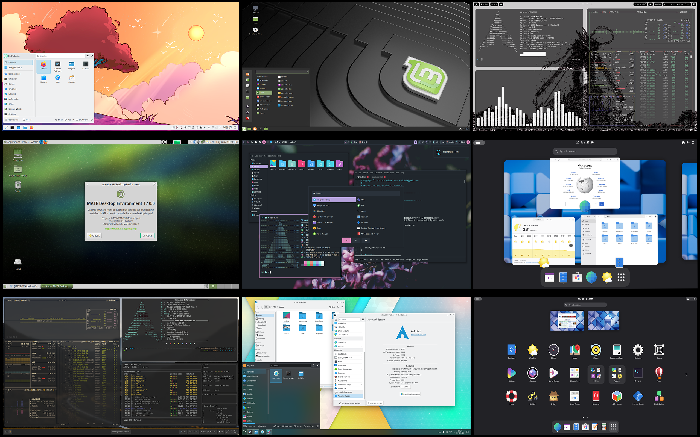
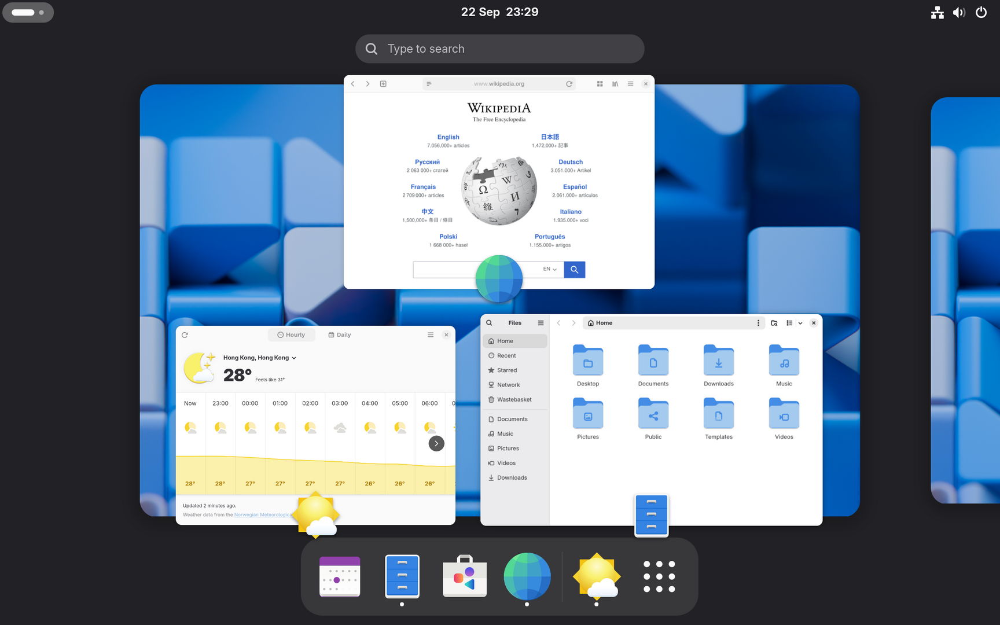

# 🖼️ Desktop Environments Overview

> Choosing the right desktop environment for your Arch Linux system.



## 📋 Table of Contents

- [What is a Desktop Environment?](#-what-is-a-desktop-environment)
- [Comparison Chart](#-comparison-chart)
- [Desktop Environments](#-desktop-environments)
- [Window Managers](#-window-managers)
- [Display Managers](#-display-managers)
- [Making Your Choice](#-making-your-choice)

---

## 💡 What is a Desktop Environment?

A **Desktop Environment (DE)** provides a complete graphical interface including:

- Window manager
- File manager
- Settings/control panel
- Default applications
- Icons and themes
- System tray and notifications

### DE vs Window Manager

| Component | Description |
|-----------|-------------|
| **Desktop Environment** | Complete package (GNOME, KDE, XFCE) |
| **Window Manager** | Just manages windows (i3, bspwm, Hyprland) |

---

## 📊 Comparison Chart

| DE/WM | RAM Usage | Customization | Learning Curve | Best For |
|-------|-----------|---------------|----------------|----------|
| **GNOME** | ~800MB | Limited | Easy | Modern workflow |
| **KDE Plasma** | ~600MB | Extreme | Easy | Windows-like |
| **XFCE** | ~300MB | Moderate | Easy | Older hardware |
| **Cinnamon** | ~500MB | Moderate | Easy | Linux Mint users |
| **MATE** | ~350MB | Moderate | Easy | GNOME 2 fans |
| **i3wm** | ~50MB | High | Steep | Keyboard users |
| **Hyprland** | ~100MB | Very High | Steep | Modern tiling |
| **Sway** | ~80MB | High | Steep | i3 + Wayland |

---

## 🖥️ Desktop Environments

### GNOME



**Modern, clean, and streamlined.**

| Aspect | Details |
|--------|---------|
| **Style** | macOS-like, Activities overview |
| **Protocol** | Wayland (default), X11 |
| **RAM** | ~800MB |
| **Apps** | Nautilus, GNOME Terminal, etc. |

```bash
sudo pacman -S gnome gnome-extra
sudo systemctl enable gdm
```

**Pros:**
- Beautiful, modern design
- Great touchpad/touch support
- Strong Wayland support

**Cons:**
- Limited customization without extensions
- Resource heavy
- Extensions can break with updates

---

### KDE Plasma


**Highly customizable, feature-rich.**

| Aspect | Details |
|--------|---------|
| **Style** | Windows-like, highly flexible |
| **Protocol** | X11 and Wayland |
| **RAM** | ~600MB |
| **Apps** | Dolphin, Konsole, Kate, etc. |

```bash
sudo pacman -S plasma kde-applications
sudo systemctl enable sddm
```

**Pros:**
- Extremely customizable
- Windows-like experience
- Lighter than GNOME

**Cons:**
- Can be overwhelming
- Inconsistent theming in some apps

---

### XFCE


**Lightweight and traditional.**

| Aspect | Details |
|--------|---------|
| **Style** | Traditional, modular |
| **Protocol** | X11 |
| **RAM** | ~300MB |
| **Apps** | Thunar, xfce4-terminal, etc. |

```bash
sudo pacman -S xfce4 xfce4-goodies
sudo systemctl enable lightdm
sudo pacman -S lightdm-gtk-greeter
```

**Pros:**
- Very lightweight
- Stable and reliable
- Good for older hardware

**Cons:**
- Dated appearance (can be themed)
- No Wayland support

---

### Cinnamon


**Traditional layout with modern features.**

| Aspect | Details |
|--------|---------|
| **Style** | Windows-like, traditional |
| **Protocol** | X11, Wayland (experimental) |
| **RAM** | ~500MB |
| **Origin** | Linux Mint |

```bash
sudo pacman -S cinnamon nemo-fileroller
sudo systemctl enable lightdm
```

**Pros:**
- Familiar for Windows users
- Good balance of features and weight

**Cons:**
- Primarily X11

---

### MATE


**GNOME 2 continuation.**

| Aspect | Details |
|--------|---------|
| **Style** | Classic GNOME 2 |
| **Protocol** | X11 |
| **RAM** | ~350MB |
| **Fork of** | GNOME 2 |

```bash
sudo pacman -S mate mate-extra
sudo systemctl enable lightdm
```

**Pros:**
- Lightweight
- Traditional desktop paradigm
- Very stable

**Cons:**
- Dated appearance

---

## 🪟 Window Managers

### Hyprland (Wayland) ⭐


**Modern, dynamic tiling compositor for Wayland.**

| Aspect | Details |
|--------|---------|
| **Type** | Dynamic tiling compositor |
| **Protocol** | Wayland only |
| **Config** | Text file (~/.config/hypr/) |
| **Animations** | Beautiful, smooth |

```bash
sudo pacman -S hyprland kitty wofi waybar
```

**Pros:**
- Beautiful animations
- Modern Wayland features
- Highly configurable
- Active development

**Cons:**
- Steep learning curve
- Requires manual configuration
- NVIDIA support improving but not perfect

→ [Full Hyprland Guide](hyprland.md)

---

### i3wm (X11)

**The classic tiling window manager.**

| Aspect | Details |
|--------|---------|
| **Type** | Manual tiling |
| **Protocol** | X11 |
| **Config** | Text file (~/.config/i3/) |

```bash
sudo pacman -S i3-wm i3status i3lock dmenu
```

**Pros:**
- Battle-tested, stable
- Large community
- Extensive documentation

**Cons:**
- X11 only
- Basic aesthetics by default

---

### Sway (Wayland)

**i3-compatible Wayland compositor.**

| Aspect | Details |
|--------|---------|
| **Type** | Manual tiling |
| **Protocol** | Wayland |
| **Config** | i3-compatible |

```bash
sudo pacman -S sway swaylock swayidle waybar wofi
```

**Pros:**
- i3 config compatible
- Modern Wayland
- Stable

**Cons:**
- Learning curve
- Some X11 apps need XWayland

---

## 🚪 Display Managers

**Display Managers (DM)** provide graphical login screens.

### Comparison

| DM | Best For | Features |
|----|----------|----------|
| **GDM** | GNOME | Wayland native, sleek |
| **SDDM** | KDE | Themeable, QML-based |
| **LightDM** | Any DE | Lightweight, flexible |
| **ly** | Minimal | TUI-based, very light |

### GDM (GNOME Display Manager)

```bash
sudo pacman -S gdm
sudo systemctl enable gdm
```

Best for: GNOME, Wayland sessions

---

### SDDM (Simple Desktop Display Manager)

```bash
sudo pacman -S sddm
sudo systemctl enable sddm
```

Best for: KDE Plasma, highly themeable

---

### LightDM

```bash
sudo pacman -S lightdm lightdm-gtk-greeter
sudo systemctl enable lightdm
```

Best for: XFCE, Cinnamon, general use

---

### No Display Manager (TTY Login)

You can also start your DE/WM from command line:

```bash
# Add to ~/.bash_profile or ~/.zprofile
if [ -z "$DISPLAY" ] && [ "$XDG_VTNR" -eq 1 ]; then
    exec startx  # For X11
    # OR
    exec Hyprland  # For Hyprland
fi
```

---

## 🎯 Making Your Choice

### For Beginners

| Want | Choose |
|------|--------|
| Just works, modern | GNOME |
| Windows-like | KDE Plasma |
| Lightweight, simple | XFCE |

### For Experienced Users

| Want | Choose |
|------|--------|
| Maximum control | Hyprland / i3 |
| Keyboard-driven | i3 / Sway |
| Beautiful + Functional | Hyprland |

### For Specific Hardware

| Hardware | Recommendation |
|----------|----------------|
| Old PC (<4GB RAM) | XFCE, MATE, i3 |
| Laptop | GNOME, KDE (touchpad gestures) |
| NVIDIA GPU | KDE, i3 (Wayland improving) |
| HiDPI Display | GNOME, KDE, Hyprland |

---

## 🔗 Detailed Guides

- [Hyprland Setup](hyprland.md)
- [KDE Plasma Setup](kde-plasma.md)
- [GNOME Setup](gnome.md)
- [XFCE Setup](xfce.md)
- [Display Managers](display-managers.md)

---

## ➡️ Next Steps

Choose your desktop environment and follow the specific guide:

| Guide | Description |
|-------|-------------|
| [Hyprland](hyprland.md) | Modern tiling compositor |
| [KDE Plasma](kde-plasma.md) | Feature-rich desktop |
| [GNOME](gnome.md) | Modern workflow |
| [XFCE](xfce.md) | Lightweight desktop |

---

<div align="center">

[← Audio & Bluetooth](../04-post-installation/audio-bluetooth.md) | [Back to Main Guide](../../README.md) | [Next: Choose Your DE →](gnome.md)

</div>
