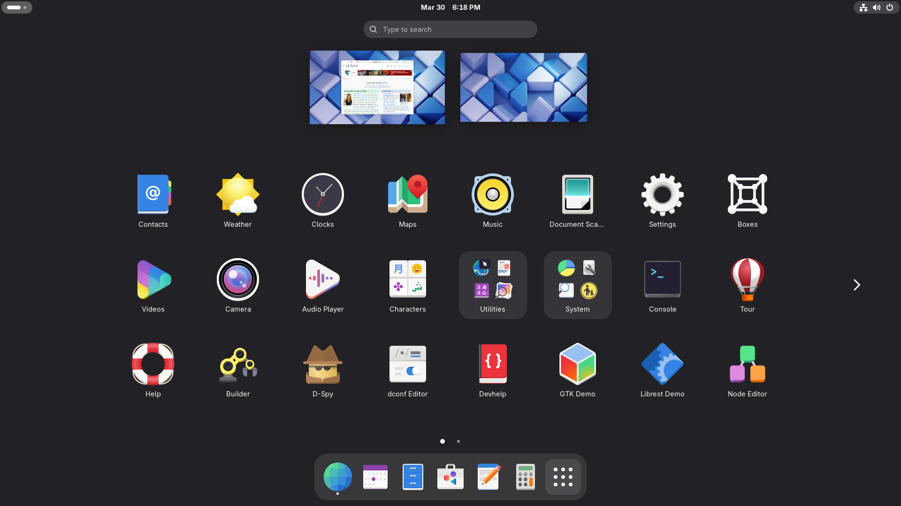

# 🟠 GNOME Installation

> Modern, streamlined desktop environment.



## 📦 Installation

### Full Installation

```bash
sudo pacman -S gnome gnome-extra
```

### Minimal Installation

```bash
sudo pacman -S gnome-shell gnome-control-center gnome-terminal nautilus gdm
```

### Enable Display Manager

```bash
sudo systemctl enable gdm
```

### Reboot

```bash
sudo reboot
```

---

## 🔧 Essential Extensions

Install GNOME Extensions support:

```bash
sudo pacman -S gnome-browser-connector
```

Recommended extensions:
- Dash to Dock
- AppIndicator
- Blur My Shell

---

## ➡️ Next Steps

→ [Essential Software](../06-essential-software/essential-packages.md)

---

<div align="center">

[← DE Overview](de-overview.md) | [Back to Main Guide](../../README.md)

</div>
