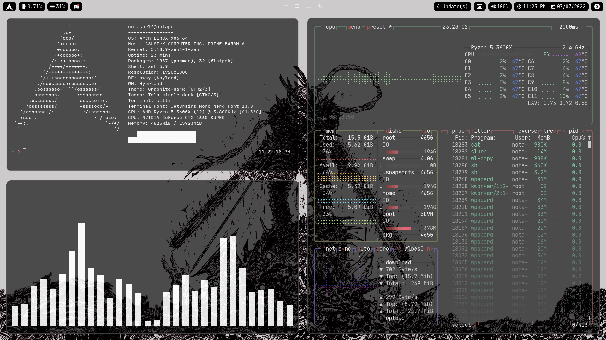
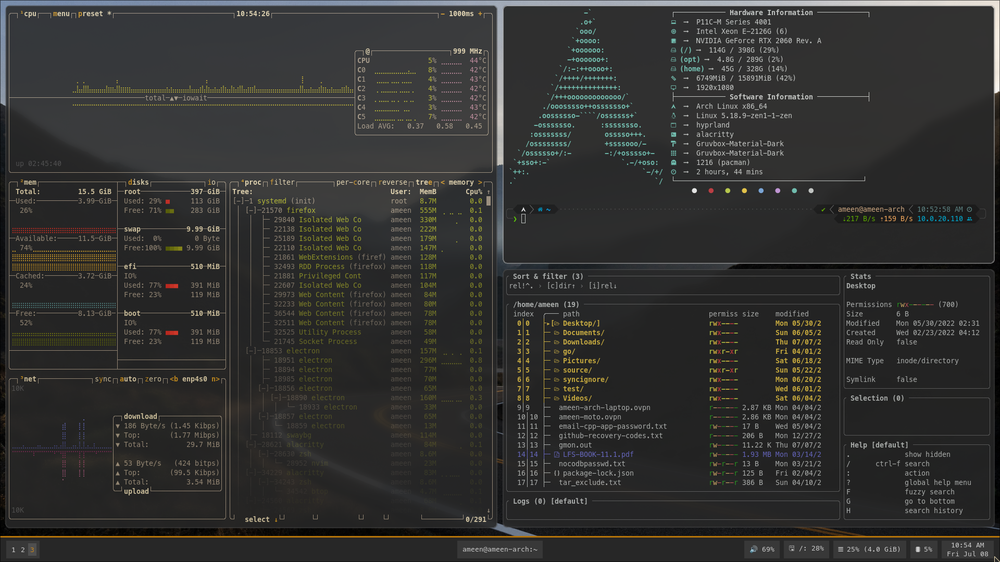

# 🌊 Hyprland Installation Guide

> Setting up Hyprland - the modern dynamic tiling Wayland compositor.


## 📋 Table of Contents

- [What is Hyprland?](#-what-is-hyprland)
- [Prerequisites](#-prerequisites)
- [Installation](#-installation)
- [Essential Tools](#-essential-tools)
- [First Launch](#-first-launch)
- [Basic Configuration](#-basic-configuration)
- [Recommended Setup](#-recommended-setup)

---

## 🌊 What is Hyprland?

**Hyprland** is a dynamic tiling Wayland compositor with beautiful animations and modern features.

### Features

| Feature | Description |
|---------|-------------|
| **Animations** | Smooth window/workspace animations |
| **Tiling** | Automatic window tiling |
| **Wayland** | Modern display protocol |
| **Eye Candy** | Blur, shadows, rounded corners |
| **Highly Configurable** | Single config file |

### Screenshots




---

## ✅ Prerequisites

### Required
- Working Arch Linux installation
- GPU drivers installed
- Basic terminal knowledge

### GPU Notes

| GPU | Status |
|-----|--------|
| AMD | ✅ Excellent support |
| Intel | ✅ Excellent support |
| NVIDIA | ⚠️ Works, requires configuration |

For **NVIDIA users**, add these to your config:

```bash
env = LIBVA_DRIVER_NAME,nvidia
env = XDG_SESSION_TYPE,wayland
env = GBM_BACKEND,nvidia-drm
env = __GLX_VENDOR_LIBRARY_NAME,nvidia
env = WLR_NO_HARDWARE_CURSORS,1
```

---

## 📦 Installation

### Install Hyprland

```bash
sudo pacman -S hyprland
```

### Install Essential Components

```bash
# Terminal emulator
sudo pacman -S kitty

# Application launcher
sudo pacman -S wofi

# Status bar
sudo pacman -S waybar

# Notification daemon
sudo pacman -S mako

# Screen locker
sudo pacman -S swaylock

# Wallpaper utility
sudo pacman -S hyprpaper
# OR
sudo pacman -S swaybg

# Screenshot utility
sudo pacman -S grim slurp

# Clipboard
sudo pacman -S wl-clipboard

# File manager
sudo pacman -S thunar
```

### All-in-One Command

```bash
sudo pacman -S hyprland kitty wofi waybar mako swaylock \
hyprpaper grim slurp wl-clipboard thunar polkit-kde-agent \
xdg-desktop-portal-hyprland qt5-wayland qt6-wayland
```

---

## 🛠️ Essential Tools

### Application Launcher - Wofi

```bash
sudo pacman -S wofi
```

**Usage:** Press `SUPER + D` (default) to open.

### Status Bar - Waybar

```bash
sudo pacman -S waybar
```

**Config location:** `~/.config/waybar/`

### Terminal - Kitty

```bash
sudo pacman -S kitty
```

Fast, GPU-accelerated terminal emulator.

### Notifications - Mako

```bash
sudo pacman -S mako
```

**Config location:** `~/.config/mako/config`

---

## 🚀 First Launch

### Option 1: From TTY

Log out of any session and at the TTY login:

```bash
# Login as your user
Hyprland
```

### Option 2: Add to Shell Profile

Edit `~/.bash_profile` or `~/.zprofile`:

```bash
if [ -z "$DISPLAY" ] && [ "$XDG_VTNR" -eq 1 ]; then
    exec Hyprland
fi
```

### Option 3: Use a Display Manager

With **SDDM**:
```bash
sudo pacman -S sddm
sudo systemctl enable sddm
```

Hyprland will appear as a session option.

---

## ⚙️ Basic Configuration

### Config Location

```
~/.config/hypr/hyprland.conf
```

### Default Keybindings

| Keybind | Action |
|---------|--------|
| `SUPER + Q` | Kill active window |
| `SUPER + Enter` | Open terminal (kitty) |
| `SUPER + D` | Open app launcher (wofi) |
| `SUPER + E` | Open file manager |
| `SUPER + V` | Toggle floating |
| `SUPER + P` | Toggle pseudo-tiling |
| `SUPER + 1-9` | Switch to workspace |
| `SUPER + SHIFT + 1-9` | Move window to workspace |
| `SUPER + Mouse` | Move/resize windows |
| `SUPER + M` | Exit Hyprland |

### Sample Configuration

```bash
# Create config directory
mkdir -p ~/.config/hypr

# Edit config
nvim ~/.config/hypr/hyprland.conf
```

**Basic hyprland.conf:**

```bash
# Monitor configuration
monitor=,preferred,auto,1

# Execute at launch
exec-once = waybar
exec-once = mako
exec-once = hyprpaper

# Environment variables
env = XCURSOR_SIZE,24

# Input configuration
input {
    kb_layout = us
    follow_mouse = 1
    touchpad {
        natural_scroll = yes
    }
    sensitivity = 0
}

# General settings
general {
    gaps_in = 5
    gaps_out = 10
    border_size = 2
    col.active_border = rgba(33ccffee) rgba(00ff99ee) 45deg
    col.inactive_border = rgba(595959aa)
    layout = dwindle
}

# Decoration (blur, shadows, etc.)
decoration {
    rounding = 10
    blur {
        enabled = true
        size = 3
        passes = 1
    }
    shadow {
        enabled = yes
        range = 4
        render_power = 3
        color = rgba(1a1a1aee)
    }
}

# Animations
animations {
    enabled = yes
    bezier = myBezier, 0.05, 0.9, 0.1, 1.05
    animation = windows, 1, 7, myBezier
    animation = windowsOut, 1, 7, default, popin 80%
    animation = border, 1, 10, default
    animation = fade, 1, 7, default
    animation = workspaces, 1, 6, default
}

# Layout
dwindle {
    pseudotile = yes
    preserve_split = yes
}

# Keybindings
$mainMod = SUPER

bind = $mainMod, Return, exec, kitty
bind = $mainMod, Q, killactive
bind = $mainMod, M, exit
bind = $mainMod, E, exec, thunar
bind = $mainMod, V, togglefloating
bind = $mainMod, D, exec, wofi --show drun
bind = $mainMod, P, pseudo
bind = $mainMod, J, togglesplit

# Move focus
bind = $mainMod, left, movefocus, l
bind = $mainMod, right, movefocus, r
bind = $mainMod, up, movefocus, u
bind = $mainMod, down, movefocus, d

# Switch workspaces
bind = $mainMod, 1, workspace, 1
bind = $mainMod, 2, workspace, 2
bind = $mainMod, 3, workspace, 3
bind = $mainMod, 4, workspace, 4
bind = $mainMod, 5, workspace, 5
bind = $mainMod, 6, workspace, 6
bind = $mainMod, 7, workspace, 7
bind = $mainMod, 8, workspace, 8
bind = $mainMod, 9, workspace, 9
bind = $mainMod, 0, workspace, 10

# Move to workspace
bind = $mainMod SHIFT, 1, movetoworkspace, 1
bind = $mainMod SHIFT, 2, movetoworkspace, 2
bind = $mainMod SHIFT, 3, movetoworkspace, 3
bind = $mainMod SHIFT, 4, movetoworkspace, 4
bind = $mainMod SHIFT, 5, movetoworkspace, 5
bind = $mainMod SHIFT, 6, movetoworkspace, 6
bind = $mainMod SHIFT, 7, movetoworkspace, 7
bind = $mainMod SHIFT, 8, movetoworkspace, 8
bind = $mainMod SHIFT, 9, movetoworkspace, 9
bind = $mainMod SHIFT, 0, movetoworkspace, 10

# Mouse bindings
bindm = $mainMod, mouse:272, movewindow
bindm = $mainMod, mouse:273, resizewindow

# Screenshot
bind = , Print, exec, grim -g "$(slurp)" - | wl-copy
bind = SHIFT, Print, exec, grim - | wl-copy
```

---

## 🎨 Recommended Setup

### Waybar Configuration

```bash
mkdir -p ~/.config/waybar
nvim ~/.config/waybar/config
```

**Basic Waybar config:**

```json
{
    "layer": "top",
    "position": "top",
    "height": 30,
    "modules-left": ["hyprland/workspaces"],
    "modules-center": ["clock"],
    "modules-right": ["pulseaudio", "network", "battery", "tray"],
    
    "hyprland/workspaces": {
        "format": "{icon}",
        "on-click": "activate"
    },
    
    "clock": {
        "format": "{:%H:%M  %Y-%m-%d}"
    },
    
    "pulseaudio": {
        "format": "🔊 {volume}%"
    },
    
    "network": {
        "format-wifi": "📶 {essid}",
        "format-ethernet": "🌐 {ipaddr}",
        "format-disconnected": "❌ Disconnected"
    },
    
    "battery": {
        "format": "🔋 {capacity}%"
    },
    
    "tray": {
        "spacing": 10
    }
}
```

### Wallpaper with Hyprpaper

```bash
mkdir -p ~/.config/hypr
nvim ~/.config/hypr/hyprpaper.conf
```

```bash
preload = ~/Pictures/wallpaper.jpg
wallpaper = ,~/Pictures/wallpaper.jpg
```

---

## 📋 Quick Reference

```bash
# Install Hyprland and essentials
sudo pacman -S hyprland kitty wofi waybar mako swaylock \
hyprpaper grim slurp wl-clipboard thunar polkit-kde-agent \
xdg-desktop-portal-hyprland qt5-wayland qt6-wayland

# Create config
mkdir -p ~/.config/hypr
nvim ~/.config/hypr/hyprland.conf

# Start Hyprland
Hyprland
```

---

## 🔗 Resources

- [Hyprland Wiki](https://wiki.hyprland.org/)
- [Hyprland GitHub](https://github.com/hyprwm/Hyprland)
- [r/hyprland](https://www.reddit.com/r/hyprland/)

---

## ➡️ Next Steps

Check out my Hyprland dotfiles repository for my complete configuration!

→ [Essential Software](../06-essential-software/essential-packages.md)

---

<div align="center">

[← DE Overview](de-overview.md) | [Back to Main Guide](../../README.md) | [Next: Essential Software →](../06-essential-software/essential-packages.md)

</div>
