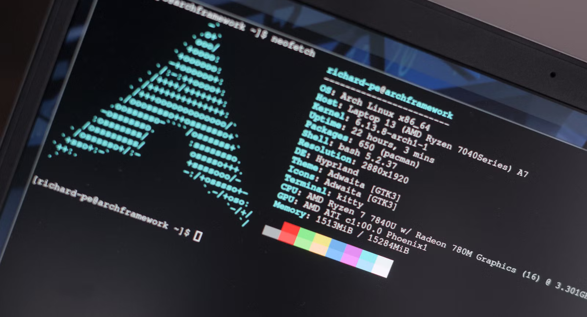

# 📦 Essential Packages

> Must-have packages after installing Arch Linux.



## 📋 Table of Contents

- [System Utilities](#-system-utilities)
- [Development Tools](#-development-tools)
- [Media & Graphics](#-media--graphics)
- [Internet & Communication](#-internet--communication)
- [Office & Productivity](#-office--productivity)
- [System Monitoring](#-system-monitoring)

---

## 🔧 System Utilities

### File Management

```bash
sudo pacman -S thunar        # GUI file manager
sudo pacman -S ranger        # Terminal file manager
sudo pacman -S mc            # Midnight Commander
sudo pacman -S unzip zip     # Archive tools
sudo pacman -S p7zip         # 7zip support
sudo pacman -S unrar         # RAR support
```

### Terminal Emulators

```bash
sudo pacman -S kitty         # GPU-accelerated
sudo pacman -S alacritty     # Fast, minimal
sudo pacman -S wezterm       # Feature-rich
```

### Shell & Terminal Tools

```bash
sudo pacman -S zsh           # Z shell
sudo pacman -S fish          # Friendly shell
sudo pacman -S starship      # Cross-shell prompt
sudo pacman -S tmux          # Terminal multiplexer
sudo pacman -S btop          # System monitor
sudo pacman -S neofetch      # System info
sudo pacman -S bat           # Better cat
sudo pacman -S eza           # Better ls (modern replacement for exa)
sudo pacman -S ripgrep       # Better grep
sudo pacman -S fd            # Better find
sudo pacman -S fzf           # Fuzzy finder
```

### Disk & System

```bash
sudo pacman -S gparted       # Partition manager
sudo pacman -S gnome-disk-utility  # Disk utility
sudo pacman -S ntfs-3g       # NTFS support
sudo pacman -S dosfstools    # FAT tools
```

---

## 💻 Development Tools

### Editors

```bash
sudo pacman -S neovim        # Modern vim
sudo pacman -S code          # VS Code (OSS)
sudo pacman -S sublime-text  # Sublime Text (AUR)
```

### Version Control

```bash
sudo pacman -S git           # Version control
sudo pacman -S github-cli    # GitHub CLI
sudo pacman -S lazygit       # Git TUI
```

### Languages & Runtimes

```bash
# Python
sudo pacman -S python python-pip

# Node.js
sudo pacman -S nodejs npm

# Rust
sudo pacman -S rustup
rustup default stable

# Go
sudo pacman -S go

# Java
sudo pacman -S jdk-openjdk
```

### Containers & VMs

```bash
sudo pacman -S docker docker-compose
sudo systemctl enable docker
sudo usermod -aG docker $USER

# Virtual machines
sudo pacman -S qemu virt-manager libvirt
sudo systemctl enable libvirtd
```

---

## 🎨 Media & Graphics

### Image Viewers & Editors

```bash
sudo pacman -S imv           # Image viewer (Wayland)
sudo pacman -S feh           # Image viewer (X11)
sudo pacman -S gimp          # Image editor
sudo pacman -S inkscape      # Vector graphics
```

### Video Players

```bash
sudo pacman -S mpv           # Minimal player
sudo pacman -S vlc           # VLC player
sudo pacman -S celluloid     # MPV frontend
```

### Audio

```bash
sudo pacman -S pavucontrol   # Volume control
sudo pacman -S spotify       # Spotify (AUR)
sudo pacman -S cmus          # Terminal music player
```

### Screen Recording

```bash
sudo pacman -S obs-studio    # Recording/streaming
sudo pacman -S wf-recorder   # Wayland recorder
```

---

## 🌐 Internet & Communication

### Web Browsers

```bash
sudo pacman -S firefox       # Firefox
sudo pacman -S chromium      # Chromium
# Google Chrome from AUR:
# yay -S google-chrome
```

### Communication

```bash
sudo pacman -S discord       # Discord
sudo pacman -S telegram-desktop  # Telegram
sudo pacman -S thunderbird   # Email client
```

### Download & Network

```bash
sudo pacman -S wget curl     # Download tools
sudo pacman -S aria2         # Download manager
sudo pacman -S transmission-gtk  # Torrent client
sudo pacman -S filezilla     # FTP client
```

---

## 📝 Office & Productivity

### Office Suite

```bash
sudo pacman -S libreoffice-fresh  # Full office suite
# OR minimal:
sudo pacman -S libreoffice-still
```

### PDF & Documents

```bash
sudo pacman -S zathura       # PDF viewer (vim-like)
sudo pacman -S evince        # PDF viewer (GNOME)
sudo pacman -S okular        # PDF viewer (KDE)
```

### Note Taking

```bash
sudo pacman -S obsidian      # Note taking
sudo pacman -S logseq        # Knowledge management
```

---

## 📊 System Monitoring

```bash
sudo pacman -S htop          # Process viewer
sudo pacman -S btop          # Resource monitor
sudo pacman -S nvtop         # GPU monitor (NVIDIA)
sudo pacman -S iotop         # IO monitor
sudo pacman -S nethogs       # Network monitor
```

---

## 📋 Quick Install Script

### Essential Desktop Setup

```bash
sudo pacman -S --needed \
    kitty thunar ranger \
    neovim git \
    firefox \
    btop neofetch \
    unzip zip p7zip \
    mpv imv \
    bat eza ripgrep fd fzf
```

### Development Setup

```bash
sudo pacman -S --needed \
    base-devel git \
    neovim \
    python python-pip \
    nodejs npm \
    docker docker-compose
```

---

## ➡️ Next Steps

→ [AUR Helpers](aur-helpers.md) - Access the AUR
→ [Recommended Apps](recommended-apps.md) - More applications

---

<div align="center">

[← Next: AUR Helpers](aur-helpers.md)| [Back to Main Guide](../../README.md) | [Next: Troubleshotting →](docs/08-troubleshooting/README.md)

</div>
